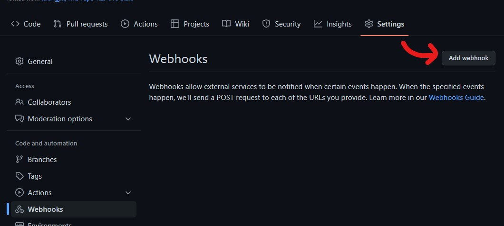

# python-webhook

This-repo-has-N-stars python-webhook version.

## Environment

| name               | description    | value                   |
| ------------------ | -------------- | ----------------------- |
| __GITHUB_TOKEN__   | GitHub Token   | Required                |
| __WEBHOOK_SECRET__ | Website Secret | Required                |
| __REPO_URL__       | Repo URL       | Required                |
| __PORT__           | Websocket Port | Optional @default: 3000 |

## Settings

1. create a new webhook in `settings -> Webhooks -> add webhook`

2. set `Payload URL` to `<Your Webhook Server URL>`
3. set `Content type` to `application/json`
4. set `Secret` to any string
5. set `Which events would you like to trigger this webhook?` to `Let me select individual events.` then select `Stars`

6. set environments

## Start

pipenv:

```sh
pipenv install
pipenv shell
python -m python-webhook
```

---

venv:

```sh
python -m venv env
source env/bin/activate # or windows: env\Scripts\activate
pip install -r requirements.txt
python -m python-webhook
```

---

docker:

```sh
docker build -d -t This-repo-has-N-stars-python-webhook . --no-cache
```

## Developer

```sh
pipenv install --dev
```
