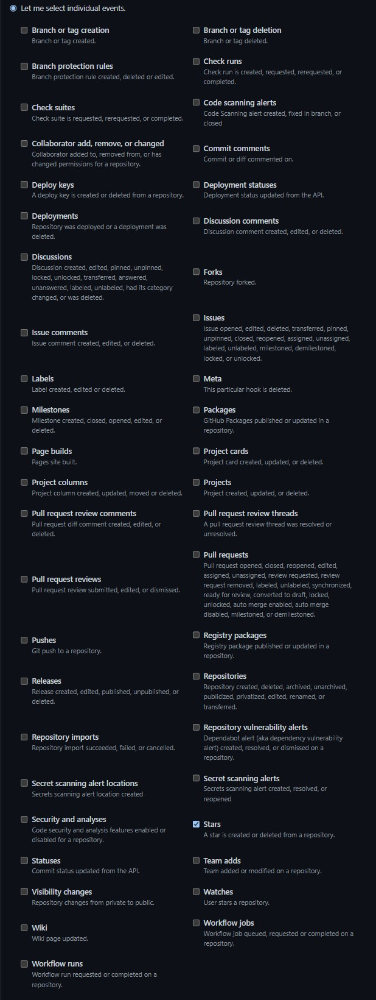

# typescript

This-repo-has-N-stars typescript version.

## Environment

| name               | description                                      | value                   |
| ------------------ | ------------------------------------------------ | ----------------------- |
| __GITHUB_TOKEN__   | GitHub Token                                     | Required                |
| __WEBHOOK_SECRET__ | Website Secret                                   | Required                |
| __REPO_URL__       | Repo URL                                         | Required                |
| __PORT__           | Websocket Port                                   | Optional @default: 3000 |
| __ACTING_URL__     | Websocket Acting Url [smee.io](https://smee.io/) | Optional                |

## Settings

1. create a new webhook in `settings -> Webhooks -> add webhook`

2. set `Payload URL` to `<Your Webhook Server URL>`
3. set `Content type` to `application/json`
4. set `Secret` to any string
5. set `Which events would you like to trigger this webhook?` to `Let me select individual events.` then select `Stars`

6. set environments

## Start

command:

```sh
yarn install --production
yarn start
```

---

docker:

```sh
docker build -d -t This-repo-has-N-stars-typescript .
```

## Developer

```sh
yarn install
```
